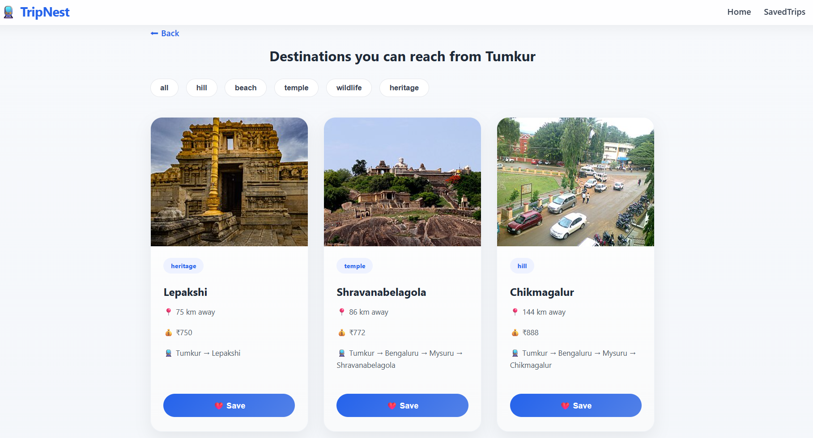
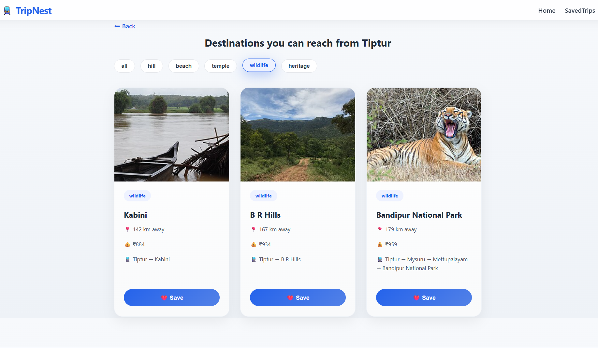
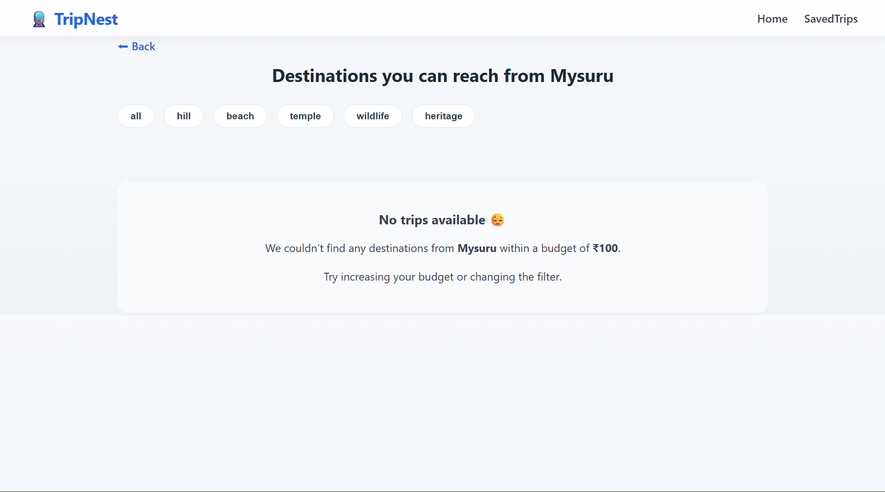

# 🚆 TripNest

TripNest is a web application that helps users discover peaceful, train-friendly travel destinations within a given budget.  
It focuses on nearby places that are realistically reachable by train and presents them in a clean, card-based UI.

## ✨ Features

- Search destinations by **source city** and **budget**
- Smart **city name normalization** (Hubli / Hubballi / Hubbli, etc.)
- Distance-based **cost estimation**  
- Realistic **train hub routing**
- Filter destinations by type:
  - Hill
  - Beach
  - Wildlife
  - Heritage
  - Temple
- Responsive **grid-based destination cards**
- Images fetched dynamically from Wikipedia
- **Saved Trips** stored using localStorage
- Graceful handling of missing data & empty results

## 📸 Project Screenshots

### Home Page

### Search Results (Grid View)

### Filtered Destinations

### Saved Trips

### No Results State

## 🛠 Tech Stack

- **React + Vite**
- **React Router** 
- **Custom CSS**
- **GeoDB Cities API** (RapidAPI)
- **Wikipedia REST API**
- **LocalStorage**

## 🧠 Key Concepts Used

- Input normalization & alias handling
- API + local database fallback
- Distance calculation using Haversine formula
- Data sorting & filtering
- Clean component structure
- User-focused UI/UX design

